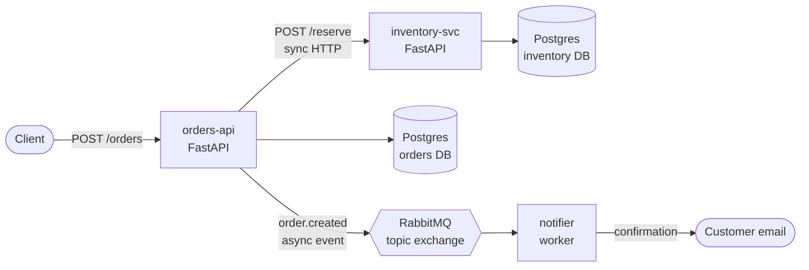

# 🛒 ShopFlow: Microservices on Kubernetes with CI/CD and GitOps

ShopFlow is a small order-processing system built as **three Python microservices**, deployed to Kubernetes with Helm. It's built in phases toward a full **CI/CD + GitOps (ArgoCD)** platform on **Amazon EKS**.

> 📖 **New here? Start with the [code walkthrough](docs/CODE_WALKTHROUGH.md).** It follows one order through the code step by step, in plain English.
>
> Kubernetes manifests live in the companion repo **[shopflow-gitops](https://github.com/chaithanyareddyk3273/shopflow-gitops)**, following the GitOps convention of keeping app code and deployment config separate.

---

## 🏗️ Architecture



| Service | Responsibility | Talks to |
|---|---|---|
| **orders-api** | Accepts orders and tracks their status (`PENDING → CONFIRMED / REJECTED / FAILED`) | inventory-svc (HTTP), Postgres, RabbitMQ |
| **inventory-svc** | Owns product stock and reserves it atomically | Postgres |
| **notifier** | Consumes `order.created` events and notifies the customer | RabbitMQ |

**Order flow:** orders-api saves the order as `PENDING` → reserves stock in inventory-svc → marks it `CONFIRMED` → publishes `order.created` → notifier sends the confirmation.

---

## 🧠 Design decisions

| Decision | Why |
|---|---|
| **Database per service** | Each service owns its data; inventory-svc is the only writer of stock. Services share one Postgres *server* for cost, but use separate *databases*. |
| **Sync HTTP for stock, async events for notifications** | The order must know immediately whether stock exists, but a notification can arrive later. A notifier outage never blocks orders. |
| **Atomic stock reservation** | `UPDATE … SET stock = stock - n WHERE sku = … AND stock >= n` is a single statement, so concurrent orders can't oversell the last item. No application-level locks. |
| **Persist the order before reserving** | Every attempt is auditable, including rejected and failed ones. |
| **Publisher confirms + mandatory routing** | RabbitMQ must acknowledge every event, and an event with no bound queue raises an error instead of vanishing silently (see below). |
| **Poison messages are dropped, not requeued** | A malformed event would otherwise be redelivered forever and block the queue. |
| **Separate liveness and readiness** | `/healthz` (liveness) never checks dependencies, so a database outage doesn't trigger a restart storm. `/readyz` (readiness) checks them, removing the pod from traffic until they recover. |
| **Memory limits, no CPU limits** | CPU requests are enough for scheduling; CPU limits cause throttling and latency spikes. |
| **Hardened pods** | Non-root user, read-only root filesystem, all Linux capabilities dropped, seccomp `RuntimeDefault`, no service-account token. |

---

## 🐛 What broke and how I fixed it

**Symptom:** on a fresh `docker compose up`, the first order was confirmed but the customer never got a notification, and nothing reported a problem.

**Root cause:** two things combined.
1. RabbitMQ's healthcheck (`rabbitmq-diagnostics ping`) passed *before* the AMQP port accepted connections. The notifier started, was refused, and backed off for 5 seconds before retrying.
2. In that window orders-api published `order.created`. A topic exchange with **no queue bound to it silently drops messages**, and the notifier hadn't declared its queue yet. The event was lost, and the publish call still returned success.

**Fix:**
- **orders-api** now uses **publisher confirms** with `mandatory=True`. An unroutable event raises `UnroutableError`, which is logged and counted in `order_event_publish_failures_total`. Lost events are now visible and can be alerted on. Covered by `tests/test_events.py`.
- **Compose** waits on `check_port_connectivity` instead of `ping`. (The Kubernetes readiness probe already did.)
- **notifier** retries every 2 seconds instead of 5.

**Verified** by starting orders-api without the notifier: the order returns `201`, the log shows `UnroutableError`, and the metric reads `1`. A full fresh start now delivers the notification. **Still open:** detection isn't the same as delivery. Guaranteeing delivery needs the transactional outbox pattern (see the roadmap).

---

## 📈 Observability

Every service exposes Prometheus metrics on `/metrics`:

| Metric | Meaning |
|---|---|
| `http_request_duration_seconds{method,route,status}` | Request rate, errors and latency per route (RED method) |
| `orders_total{status}` | Orders by final status |
| `order_event_publish_failures_total` | Confirmed orders whose event failed to publish |
| `inventory_reservations_total{result}` | Reservations: `reserved` / `out_of_stock` / `unknown_sku` |
| `notifications_total{result}` | Notifications `sent` / `malformed` |

Prometheus and Grafana dashboards arrive in Phase 3.

---

## 🚀 Run it locally

**Prerequisites:** [Docker Desktop](https://www.docker.com/products/docker-desktop/), [kind](https://kind.sigs.k8s.io/), [kubectl](https://kubernetes.io/docs/tasks/tools/), [Helm](https://helm.sh/). Clone both repos side by side:

```
projects/
├── shopflow-app/
└── shopflow-gitops/
```

### Option A: Kubernetes (kind)
```bash
cd shopflow-app
./scripts/kind-up.sh      # creates the cluster, builds + loads images, installs the Helm chart
./scripts/smoke-test.sh   # end-to-end test: order → stock → event → notification
```

### Option B: Docker Compose (no Kubernetes)
```bash
docker compose up --build
curl -X POST localhost:8080/orders -H "Content-Type: application/json" \
  -d '{"sku": "SKU-001", "quantity": 2, "customer_email": "jane@example.com"}'
```

Seeded products: `SKU-001` (Mechanical Keyboard, 50), `SKU-002` (USB-C Hub, 100), `SKU-003` (4K Monitor, 10).

### Unit tests
Each service has its own tests using in-memory fakes, so no database or broker is needed:
```bash
cd services/orders-api
pip install -r requirements.txt -r requirements-dev.txt
pytest
```

---

## 📁 Repository layout

```
shopflow-app/
├── services/
│   ├── orders-api/        # FastAPI · Postgres · RabbitMQ publisher
│   ├── inventory-svc/     # FastAPI · Postgres
│   └── notifier/          # RabbitMQ consumer + probe/metrics server
│       ├── app/
│       ├── tests/
│       ├── Dockerfile     # python:3.12-slim, non-root
│       └── requirements.txt
├── scripts/
│   ├── kind-up.sh         # local Kubernetes deploy
│   └── smoke-test.sh      # end-to-end test
├── docs/CODE_WALKTHROUGH.md  # plain-English guide: one order through the code
├── deploy/postgres-init.sql
└── docker-compose.yml
```

---

## 🗺️ Roadmap

- [x] **Phase 1: Microservices on Kubernetes.** 3 services, Dockerfiles, Helm chart, kind, tests
- [ ] **Phase 2: CI/CD + GitOps.** GitHub Actions (test → build → Trivy scan → push), ArgoCD, dev and prod environments, promotion by pull request
- [ ] **Phase 3: Production on AWS.** Terraform EKS, Prometheus + Grafana, HPA, NetworkPolicies, Sealed Secrets, Argo Rollouts canary deployments

**Known trade-offs to address:** if the database write fails after stock is reserved, that stock isn't released. The fix is a compensating action or the saga pattern. Similarly, if RabbitMQ is unavailable or the event can't be routed at publish time, the order stays confirmed but the event is not retried. The failure is logged and counted in `order_event_publish_failures_total`. The fix is the transactional outbox pattern. Both are planned for later phases.
